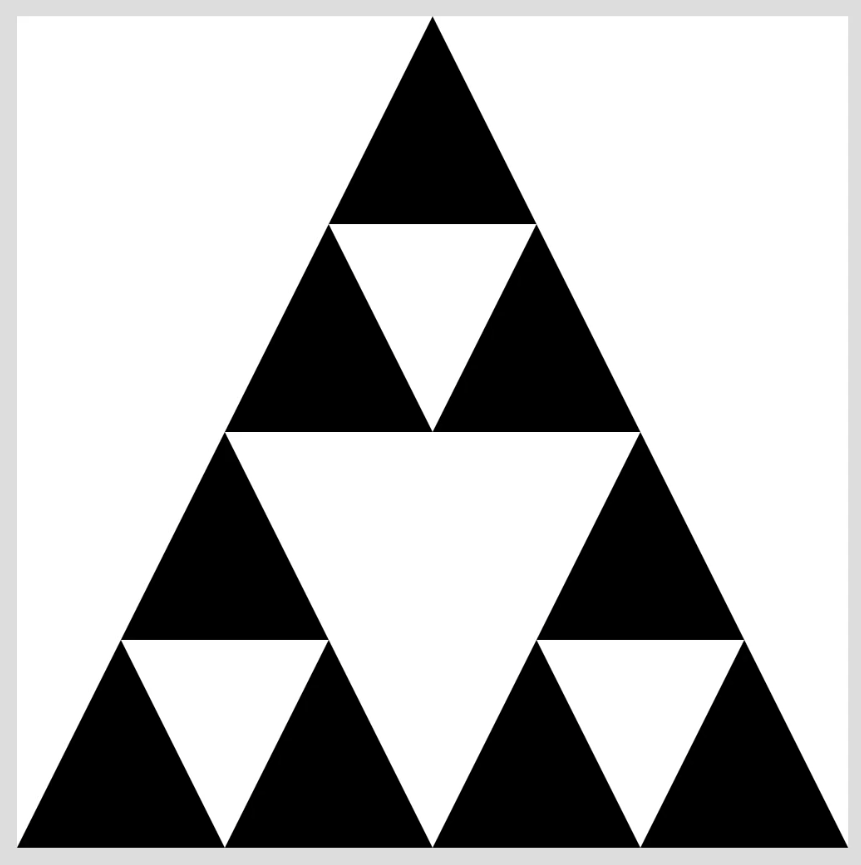

# B35: Fractal Triangle (Level 1)
After entering the number of iterations and pressing the button, you should draw the Fractal structure by 
repeating it the specified number of times.

*Note from implementor: basically a Sierpiński Triangle without the randomness*

## Requirement Notes
- There is a canvas area, a form to input numbers, and a button. 
- After entering the number of iterations and clicking the button, a fractal image is drawn. 
- The drawn image has the same fractal structure as shown in the video (equilateral triangle structure).